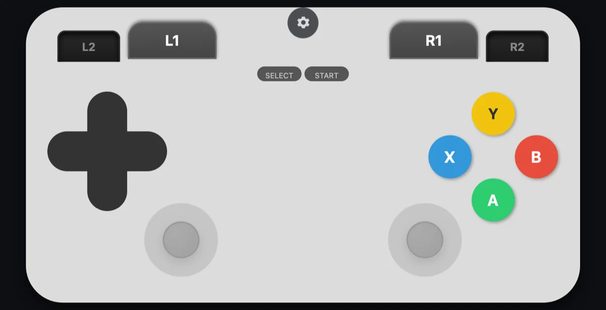
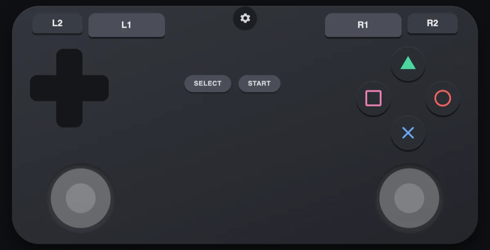
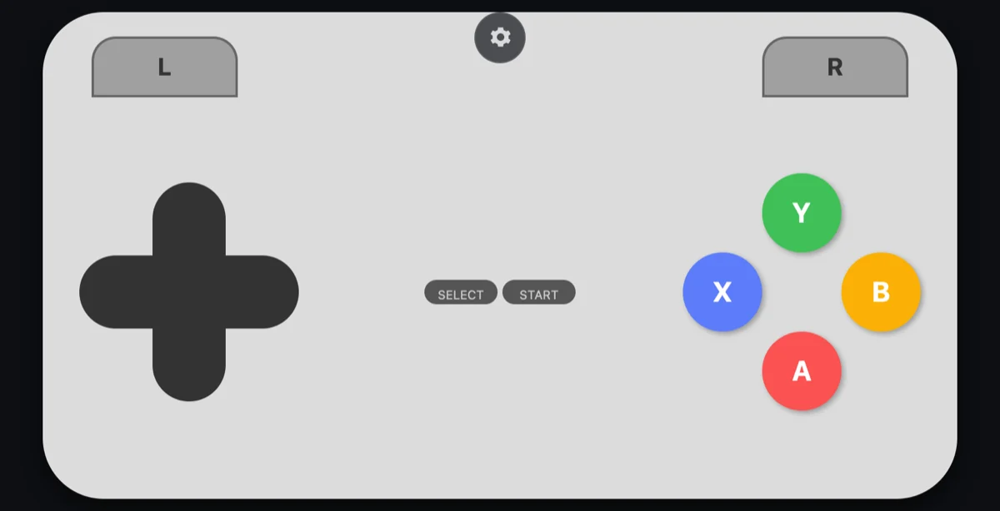
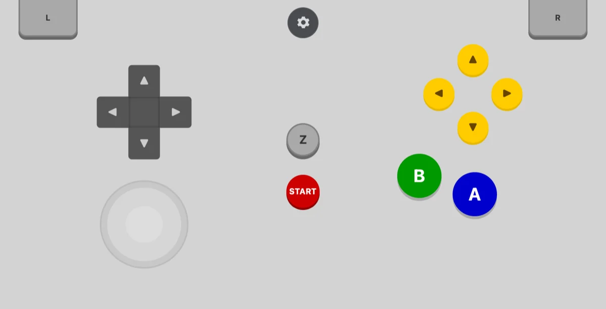
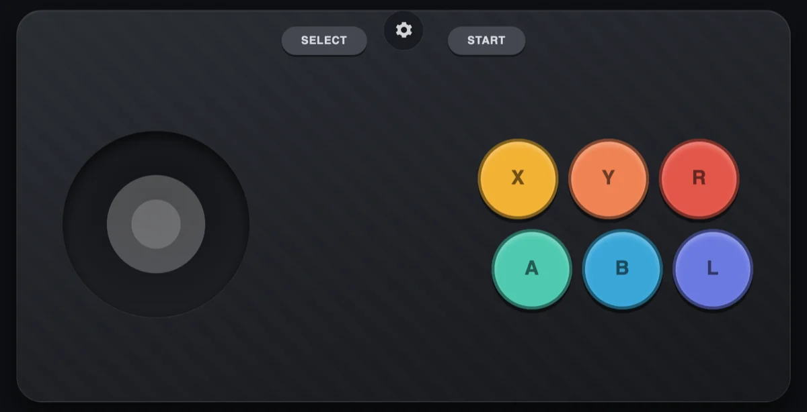

# airinput-tv

**Use your phone as a game controller for your Android TV. No app to install on
either device.**

Your phone opens a web page and becomes a gamepad. The TV sees a real controller —
not a fake mouse or key presses — so games and emulators treat it like plugged-in
hardware. Up to several phones at once, each its own controller.

This is an Android TV port of [airInput](https://github.com/DiegoCChumbi/airInput) by
Diego CCH. The original runs the server on your computer; this one runs it **on the TV
itself**, so no computer needs to stay on.


<sub>What your phone shows once it connects. No app — this is just a web page.</sub>

## How it works

```
   your phone                    your Android TV
  ┌───────────┐                ┌──────────────────────┐
  │  browser  │ ──── WiFi ───▶ │  airinput-tv server  │
  │ (gamepad  │                │          │           │
  │  buttons) │                │          ▼           │
  └───────────┘                │  virtual controller  │
                               │   → games see this   │
                               └──────────────────────┘
```

The server is one small Go program. It serves the controller web page and creates a
virtual controller for each phone that connects, using a built-in Linux feature called
`uhid`. It does **not** need root.

## Before you start

You need four things. The third one is the deal-breaker — check it first.

| | What | How to get it |
|---|---|---|
| 1 | An **Android TV** (TV, box, or stick) | — |
| 2 | A **computer** on the same WiFi | Mac, Linux, or Windows |
| 3 | **`uhid` access** on the TV | Check below — not all TVs allow this |
| 4 | **Go** and **adb** on your computer | See below |

### Install Go and adb

* **Go** — download from [go.dev/dl](https://go.dev/dl/) (version 1.21 or newer).
* **adb** — the Android debug tool.
  * macOS: `brew install android-platform-tools`
  * Linux: `sudo apt install adb` (or your distro's equivalent)
  * Windows: [SDK Platform Tools](https://developer.android.com/tools/releases/platform-tools)

## Step 1 — Turn on debugging over WiFi on the TV

On the TV, using its remote:

1. **Settings → Device Preferences → About**
2. Scroll to **Build** and click it **7 times**. You'll see *"You are now a developer"*.
3. Go back, then **Settings → Device Preferences → Developer options**
4. Turn on **USB debugging** (and **Network debugging** / **ADB over network** if your
   TV lists it separately)

Menu names vary by brand — look for "About", then "Build", then "Developer options".

## Step 2 — Find your TV's IP address

On the TV: **Settings → Network & Internet** → click your WiFi network. The IP looks
like `192.168.1.42`.

## Step 3 — Connect to the TV from your computer

```bash
adb connect YOUR-TV-IP:5555
```

Replace `YOUR-TV-IP` with the number from step 2. **Look at the TV** — it will ask you
to allow the connection. Accept it, and tick "always allow".

Check it worked:

```bash
adb devices
```

You should see your TV listed as `device`. If it says `unauthorized`, you missed the
prompt on the TV screen.

## Step 4 — Check your TV allows `uhid` ⚠️

**Do this before anything else — if it fails, this project cannot work on your TV.**

```bash
adb shell id
```

Look for `uhid` in the output, something like:

```
uid=2000(shell) gid=2000(shell) groups=...,3011(uhid),...
```

* **You see `uhid`** → you're good, continue.
* **You see `uid=0(root)`** → your TV gives adb root access. That also works; root can
  open `/dev/uhid` regardless of groups.
* **No `uhid`** → this project won't run on your TV as-is. Nothing in the later steps
  will fix it. You still have options — see
  [If your TV doesn't have `uhid`](#if-your-tv-doesnt-have-uhid) below.

## Step 5 — Build and install

```bash
git clone https://github.com/sahilas/airinput-tv.git
cd airinput-tv
./deploy.sh
```

That builds the server for your TV's processor and copies it over. If you have more
than one device connected, name the one you want:

```bash
./deploy.sh YOUR-TV-IP:5555
```

**Windows users:** `deploy.sh` is a shell script — run it from Git Bash or WSL, or do
the two steps by hand:

```bash
go build -o airinput-tv .
adb push airinput-tv /data/local/tmp/airinput-tv
```

with `GOOS=linux GOARCH=arm GOARM=7 CGO_ENABLED=0` set in your environment.

## Step 6 — Start the server

```bash
adb shell /data/local/tmp/airinput-tv
```

It prints the address to open:

```
airInput TV host ready: http://192.168.1.42:3000
```

Leave this running. (Closing your terminal stops it — see *Start it automatically*
below to fix that permanently.)

## Step 7 — Play

On your phone, open the address it printed — for example `http://192.168.1.42:3000` —
in any browser. Type a name and tap **Connect**:


The controller appears. That's it.

Connect more phones to the same address and each becomes its own separate controller.

## Choosing a layout

Tap the ⚙️ button at the top of the screen. You can switch controller layout, turn
vibration on or off, and toggle fullscreen.


Five layouts ship in `public/skins/`:

| | |
|---|---|
| **Modern** — dual sticks, D-pad, ABXY, four shoulder buttons | **Symbols** — dual sticks, shape face buttons |
|  |  |
| **Classic** — D-pad and four face buttons, no sticks | **Retro 3D** — single stick, C-buttons, Z trigger |
|  |  |
| **Arcade** — fight-stick: one stick, six big buttons | |
|  | |

Your choice is remembered on that phone, so each player can pick their own.

**Tip:** add the page to your home screen so it opens fullscreen without browser bars.

## Making your own layout

A layout ("skin") is just an HTML fragment and a stylesheet in its own folder. No
build step and no JavaScript — drop in a folder, add one line to a list, rebuild.

**1. Create the folder.** Copy an existing one to start from:

```bash
cp -r public/skins/snes public/skins/myskin
```

**2. Edit `layout.html`.** Every button carries a `data-btn` attribute naming the
control it sends. Only these names mean anything to the TV:

| Kind | Valid `data-btn` values |
|---|---|
| D-pad | `UP` `DOWN` `LEFT` `RIGHT` |
| Face | `A` `B` `X` `Y` |
| Shoulders | `L` `R` `L2` `R2` |
| Menu | `SELECT` `START` |

Anything else is ignored, silently — if a button does nothing, check its spelling
against this table first.

```html
<button data-btn="A">A</button>
```

Press two controls with one button — handy for D-pad diagonals — with `data-btns`:

```html
<button data-btns="UP,LEFT"></button>
```

For analog sticks, include one or both of these elements. Leave them out and the
skin simply has no sticks:

```html
<div id="stick-left-zone" class="stick-zone"></div>
<div id="stick-right-zone" class="stick-zone"></div>
```

`L2` and `R2` are also reported as analog triggers, because some games read the axis
rather than the button.

**3. Edit `style.css`.** Style your own markup. Two conventions worth keeping:

* `#gamepad` is the root element — give it a width and height.
* `button.active` is added while a control is held, so style it for press feedback.

Layouts are designed landscape; the app rotates the whole pad in portrait, so you
don't need a second set of rules.

**4. Register it** in [`public/skins/skins.json`](public/skins/skins.json):

```json
{ "id": "myskin", "name": "My Layout", "blurb": "What makes it different", "sticks": 2 }
```

`id` must match the folder name. `name` and `blurb` are what the settings sheet
shows.

**5. Rebuild and deploy** — `./deploy.sh`. The web client is compiled into the
binary with `go:embed`, so new files only appear after a rebuild.

While iterating, `loadSkin('myskin')` in the browser console switches to it without
opening the settings sheet.

## Start it automatically (optional, advanced)

By default you re-run step 6 after every TV reboot. To make the TV start it on its own,
you register it as a system service:

```
/system/etc/init/airinput.rc
```

**This requires a writable `/system`, which means a rooted TV or custom ROM.** Most
stock Android TVs will not let you do this — if `/system` is read-only, this option
isn't available to you, and there's no workaround short of rooting.

Once set up, Android's init both starts it at boot **and restarts it if it's killed** —
which is why `deploy.sh` only needs to push the new binary and kill the old process.

It also means **you can't stop it by killing it.** To actually stop it, remove or edit
that `.rc` file and reboot.

Logs go to `/data/local/tmp/airinput.log`.

## If your TV doesn't have `uhid`

Plenty of Android TVs don't give the `shell` user access to `/dev/uhid`. It depends on
your Android version and what the manufacturer allowed, and there's nothing this
project can do about it from the outside.

Here's what's actually open to you, most practical first.

### 1. Use your phone as a Bluetooth gamepad instead

This skips this project entirely, and for most people it's the right answer. A phone
can pair with the TV as a real Bluetooth HID gamepad — no adb, no debugging mode, no
computer. Search your phone's app store for a "Bluetooth gamepad" or "BT HID
controller" app.

Trade-off: it's a separate app rather than a web page, so it's less convenient for
guests, and quality varies a lot between apps.

### 2. Root the TV

With root, `/dev/uhid` is accessible regardless of group membership, and everything in
this README works normally.

This is genuinely the only way to make *this project* run on a locked-down TV. It also
voids your warranty, can break OTA updates, and can brick the device if you flash the
wrong image. Worth it for a spare box you're tinkering with; think hard before doing it
to the family TV.

### 3. `/dev/uinput` — tested, and it does *not* help

`uinput` is the kernel's other virtual-input mechanism, so it looks like an obvious
way around a missing `uhid`. It isn't, and it's worth knowing why before you spend time
on it.

Measured on an Android 12 TV (HiSilicon Hi3751V350):

```
crw-rw---- 1 uhid uhid 10, 239 /dev/uhid
crw-rw---- 1 uhid uhid 10, 223 /dev/uinput
```

**Both devices are owned by the same `uhid` user and group, with the same `0660`
mode.** Android gates them behind the *same* group. So a TV that withholds `uhid` from
the `shell` user withholds `/dev/uinput` in exactly the same breath — there is nothing
to fall back to. Writing a `uinput` backend would produce a second code path that fails
on precisely the devices it was meant to rescue.

This is one device, so if yours disagrees the report is genuinely useful. But the
identical ownership is a platform convention rather than a vendor quirk, so expect it
to hold.

### What won't work: `adb shell input`

You'll find suggestions to use `adb shell input keyevent`. Don't bother for gaming:

* It **isn't a gamepad.** It injects individual key events, so any game that looks for a
  connected controller still sees nothing.
* It spawns a whole process per press — far too slow for real-time play.

It's fine for scripted menu navigation. It is not a controller.

### Help us map this out

If you run the check below and paste the output into an issue, it helps build a picture
of which TVs work:

```bash
adb shell 'id; ls -l /dev/uhid /dev/uinput 2>&1; command -v uinput; getprop ro.product.model; getprop ro.build.version.release'
```

Reports from TVs that **don't** work are just as useful as ones that do.

## Troubleshooting

| Problem | Fix |
|---|---|
| `adb: command not found` | adb isn't installed — see *Before you start* |
| `device unauthorized` | Look at the TV screen and accept the prompt, then re-run `adb connect` |
| `adb connect` just hangs | Wrong IP, or debugging is off. Redo steps 1–2. Some TVs turn debugging off after a reboot. |
| No `uhid` in `adb shell id` | Your TV doesn't allow it — see [If your TV doesn't have `uhid`](#if-your-tv-doesnt-have-uhid) |
| `open /dev/uhid: permission denied` | Same cause as above |
| Server starts, phone page won't load | Phone and TV must be on the **same WiFi**. Guest networks and "client isolation" block this. |
| Page loads but buttons do nothing | Check the terminal from step 6 — it logs each controller connecting |
| Stops when I close my terminal | Expected. See *Start it automatically* |
| Games ignore the controller | Some games only read a controller present at launch — connect your phone first, then start the game |

## Good to know before you rely on this

* **Anyone on your WiFi can control your TV.** There is no password. That is fine on a
  home network you trust, and a bad idea on shared, public, or office WiFi. Don't
  forward port 3000 through your router or expose it to the internet.
* Input travels over plain WebSocket on your LAN — no encryption. Fine for gamepad
  presses; don't extend it to carry anything sensitive.
* This is a hobby project. It works on the author's TV; your TV's vendor may differ.

## Contributing

Issues and pull requests welcome — especially reports of which TV models do and don't
grant `uhid`, since that's the single thing that decides whether this works at all.
There's a one-line diagnostic to paste under
[Help us map this out](#help-us-map-this-out).

## License

MIT — see [LICENSE](LICENSE). Built on [airInput](https://github.com/DiegoCChumbi/airInput)
by Diego CCH, also MIT. Bundled third-party code is listed in
[THIRD-PARTY-NOTICES.md](THIRD-PARTY-NOTICES.md).
